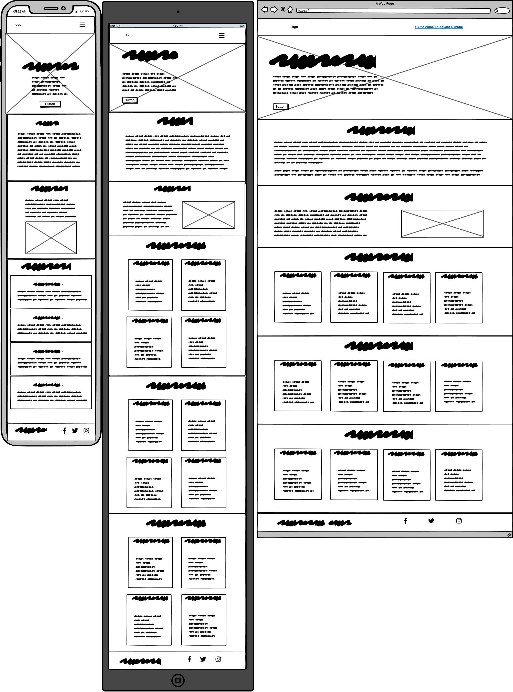
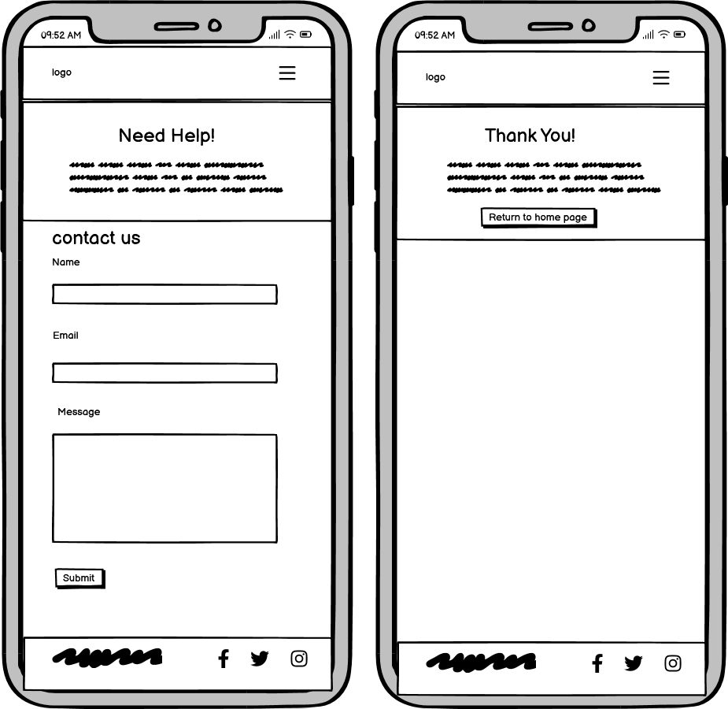
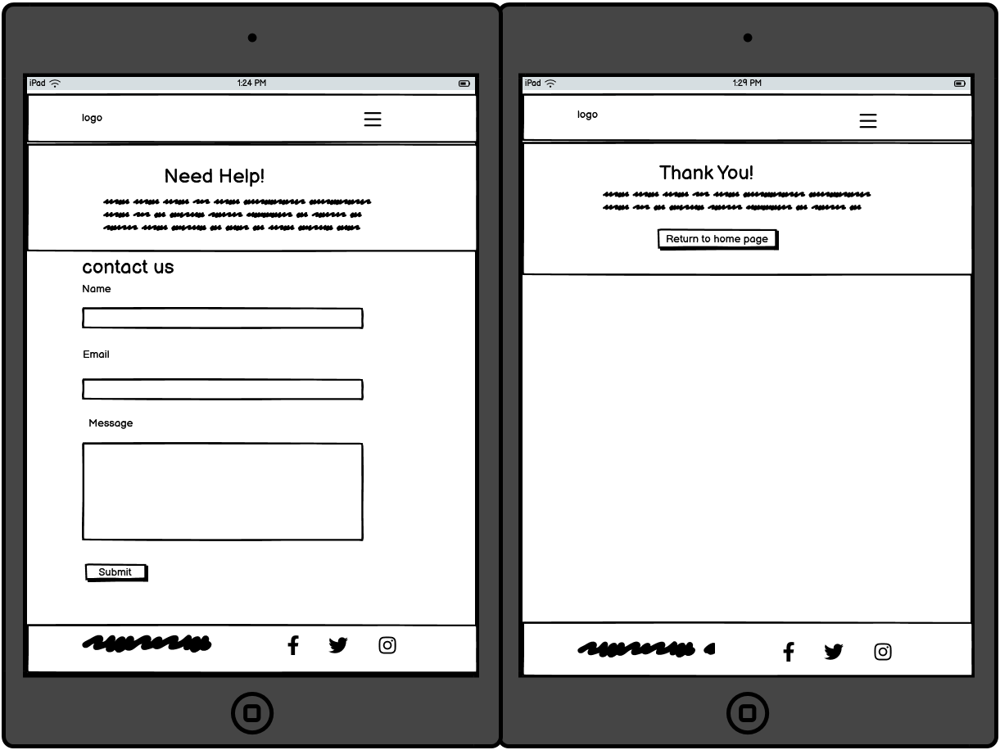
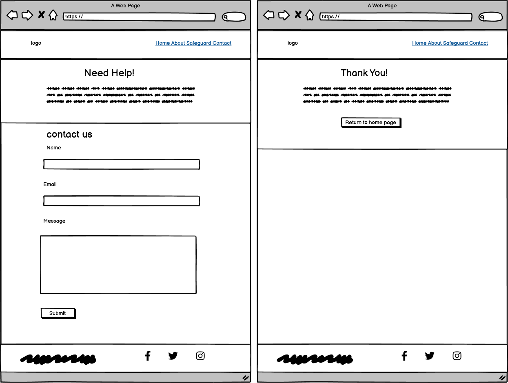
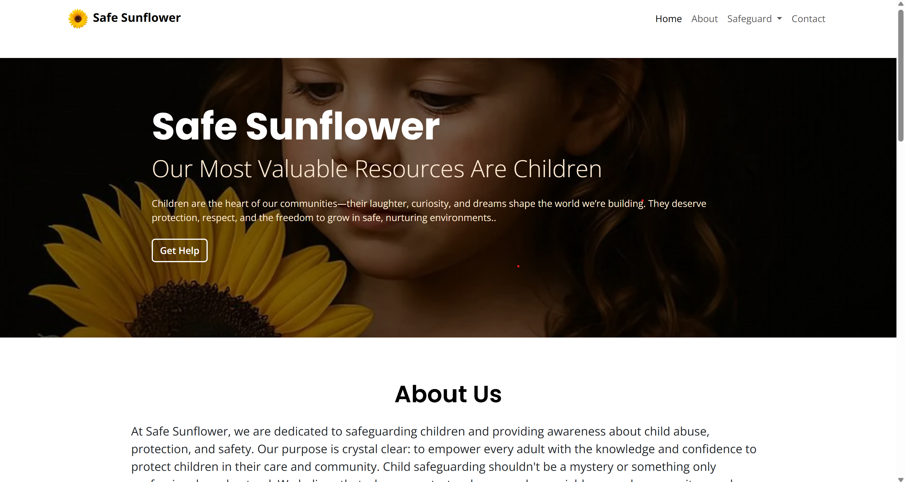
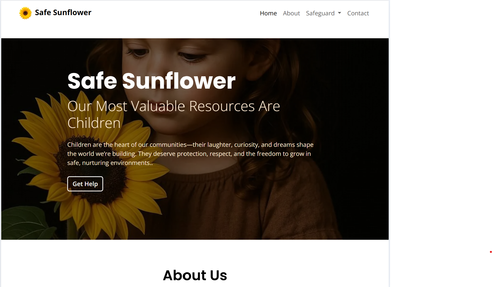
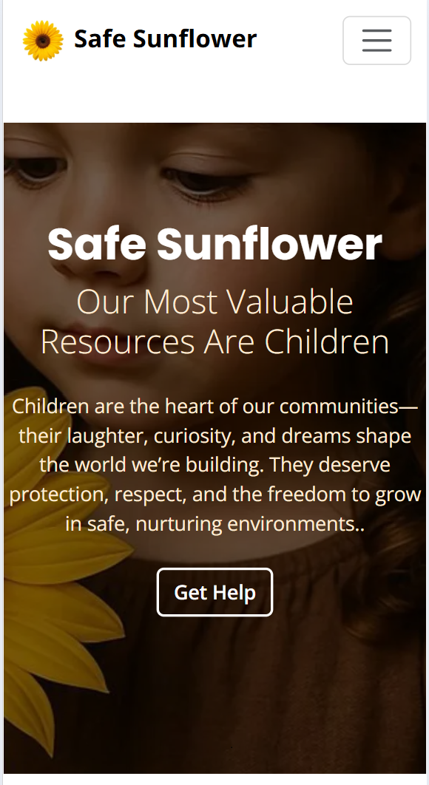
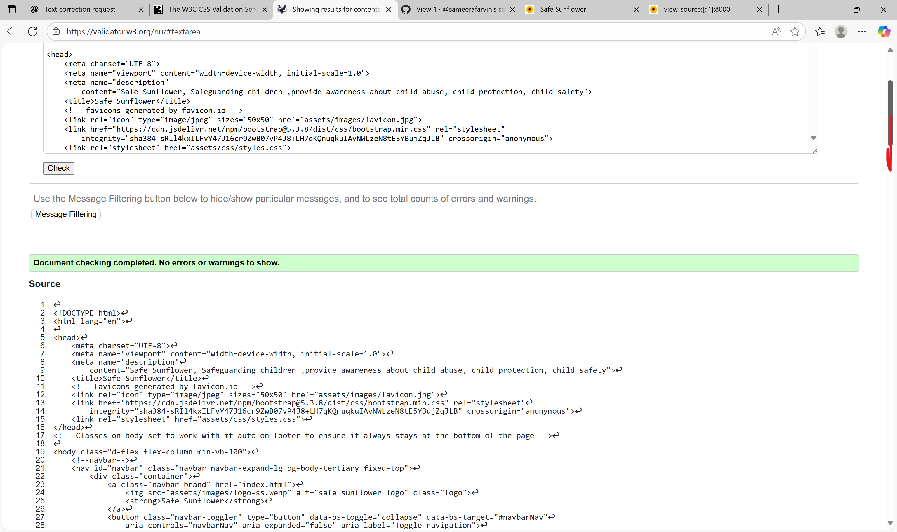
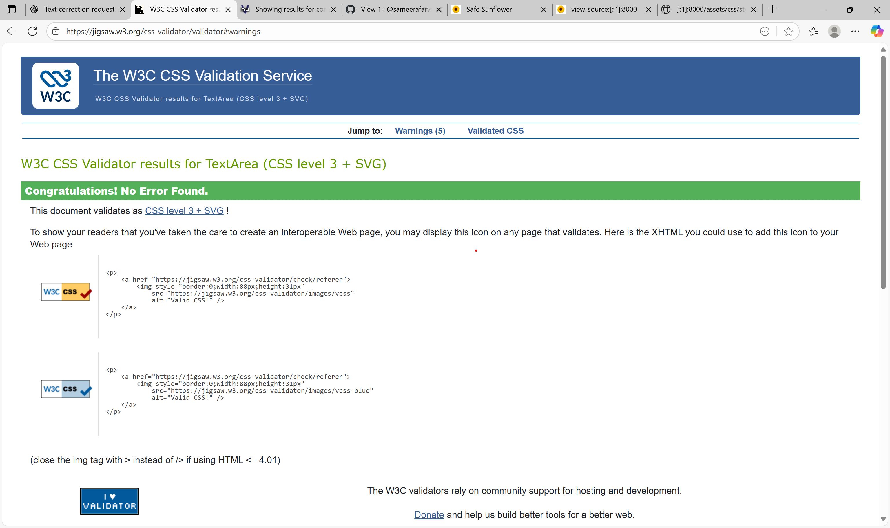
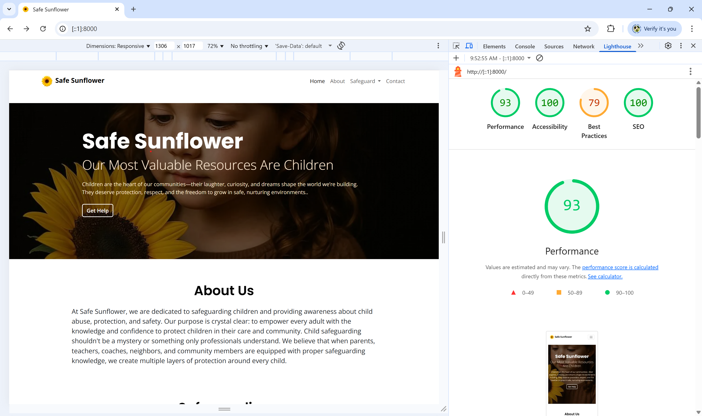

# safe-sunflower

# Overview

Safe Sunflower is my first individual project developed as part of the Code Institute AI Augmented Full Stack Software Developer Bootcamp. Safe Sunflower is a static website that consists of HTML, CSS & Bootstrap and it aims to provide clear, easy-to-understand information about the child safeguarding .

The live project can found here: <a href="https://sameerafarvin.github.io/safe-sunflower/" target="_blank">Live Project</a>

<h2 text-align="center" id="TOC">Table of Contents</h2>

-   [Safe Sunflower](#safe-sunflower)
    -   [Overview](#overview)
    -   [Table of Contents](#TOC)
-   [Project Planning](#project-planning)
    -   [UX Design](#ux-design)
        -   [User Stories](#user-stories)
        -   [Colors](#colors)
        -   [Fonts](#fonts)
        -   [Imagery](#imagery)
        -   [Wireframes](#wireframes)
-   [Features](#features)
    -   [Navigation and Hero Section](#navigation-and-hero-section)
    -   [Bootstrap Cards](#bootstrap-cards)
    -   [Info Section](#info-section)
    -   [Footer](#footer)
    -   [Contact Page](#contact-page)
    -   [Responsive Design](#responsive-design)
-   [Deployment](#deployment)
-   [Testing](#testing)
-   [Credits](#credits)

## UX Design

## User Stories

The user stories for this project as well as their acceptance criteria and tasks can be found in the <a href="https://github.com/users/sameerafarvin/projects/3" target="_blank">project board</a>.
-visitor(Children, Parents,Gaurdians)

-   As a First-Time Visitor of the page, I need easy navigation and a user-friendly design, including a responsive layout for my device, so I can find information quickly and efficiently without frustration.
-   As a visitor, I want a clear introduction to safeguarding so that I can immediately understand the importance of the topic.
-   As a visitor, I want simple explanations of what safeguarding is, signs to watch for, and how to respond so that I can recognize and act on concerns.
-   As a visitor, I want safeguarding action steps so that I can know exactly what to do if I suspect an issue
-   As a visitor, I want easy-to-find safeguarding contact information or a simple form so that I can report a concern or ask questions.

-   As a visitor, I want a resources section with links to external safeguarding organizations so that I can find more detailed help and guidance.

## Colors

I used a black and white color palette throughout the website to match the black background of the hero section. For the content, I applied specific colors to highlight key areas:

-   Red background headings for the "Signs to Watch For" section, representing danger and the importance of paying attention.
-   Dark yellow headings for the "How to Respond" section, symbolizing caution and warning.
-   Green headings for the "Action Steps" section, representing success and positive outcomes.
    These colors were chosen intentionally to guide the user’s understanding: red for danger, dark yellow for warning, and green for taking safe, successful action.

# Fonts

As with the color palette, I also wanted the font to be visually appealing and easily readable for the users to ensure they have a positive experience visiting the website.
For this project, I used Poppin and Open sans fonts and implemented them via [Google Fonts](https://fonts.google.com) using a direct import code within the style.css file.

# Imagery

I wanted to select an appropriate image for the hero image that conveyed an immediate sense of what the website is about. The hero image was generated by [Bing image creator] (https://www.bing.com/images/create/)

I mainly relied on [Font-Awesome](https://fontawesome.com/) icons so I didn't include many pictures in this project but I would like to encorporate more in future developments.

However, I used [Canva](https://www.canva.com/) to generate the logo for my website which is incorporated into my design as the favicon and the navbar

I chose a sunflower as the logo for the child safeguarding website. The sunflower represents warmth, care, and protection — qualities that reflect the mission of safeguarding. Just as sunflowers naturally turn towards the sun for growth and safety, the logo symbolizes creating a safe and nurturing environment where children can thrive.

# Wireframes

The wireframes for this project have been created using [Balsamiq](https://balsamiq.com/). They show the key features that guided me in creating my website, ensuring responsiveness across different screen sizes.

**Mobile Wireframe**

**Tablet Wireframe**

**Desktop Wireframes**

## Features

# Navigation and Hero Section

The hero section features a striking black background with a background image of a child holding a sunflower, symbolizing care, hope, and protection.
At the center, the main heading displays the website’s name, making it instantly recognizable.
Beneath it, a subheading provides a clear and supportive message to introduce the purpose of the site. A prominent call-to-action button is placed below, directing users to the contact page for help or support.

This design immediately conveys warmth and safety while guiding users toward the support they may need.

## About Section

The About section includes a paragraph introducing the Safe Sunflower mission. It explains the website’s purpose of promoting child safeguarding, raising awareness, and offering guidance to ensure every child is protected and supported.

## Info Section

The Information section provides key details about safeguarding,sign to watch for,how to respond and action steps. Its purpose is to ensure that any user visiting the site can easily understand what safeguarding is and why it is important.
I have also included a picture showing children happily playing. This image highlights the idea that safeguarding is essential to ensure children’s safety, wellbeing, and happiness.

## Bootstrap Cards

I used Bootstrap cards for the sections listing the sign to watch for ,how to respond and action steps for if someone has been abused. The formatting is good for displaying bitesize chunks of information which is easily digestible.

## Footer

The footer is stuck to the bottom of the site and only visible when the user reaches the end of the page. It displays basic information about the website, social media icons so that the user can go to the site's social media pages. Since Safe Sunflower project is not a real functioning website, the links just go to the homepage of this website.

## Contact Page

When a user clicks the “Get Help” button or the Contact link in the navigation bar, they are directed to the Contact Page. This page provides information about the national helpline and includes a contact form.

The form contains fields for the user’s name, email address, and message, along with a submit button. Once the form is submitted, the user is taken to a Success Page, which displays a thank-you message confirming that their form has been successfully submitted.

## Responsive Design

For the most part, utilising the [Bootstrap Framework](https://getbootstrap.com/docs/5.3/getting-started/introduction/) allowed me to implement a responsive design fairly easily.

Here is what the website looks like on different screens:

**Desktop**

**Ipad**

**Mobile**

## Deployment

This [GitHub](https://github.com/) project was created using the [Code Institute Template](https://github.com/Code-Institute-Org/ci-full-template), making the project easier for me to navigate when opening within VS Code linked with the [Gitpod IDE](https://www.gitpod.io/).

Deploying fairly on is a good idea so you can regularly check if there are any bugs/obvious design flaws within a browser and test the website's responsiveness using Dev Tools.

The steps to deploy are as follows:

-   Go to the Settings tab of your GitHub repo.
-   On the left-hand sidebar, in the Code and automation section, select Pages.
-   Make sure the source is set to 'Deploy from Branch'.
-   Make sure the main branch is selected.
-   Make sure the folder is set to / (root).
-   Under Branch, click Save.
-   Go back to the Code tab and wait a few minutes before refreshing.
-   On the right-hand side in the Deployments section click on 'github-pages'.
-   The latest deployed link will appear at the top of the page.

## Testing

I tested and debugged the site regularly throughout the process, mainly using Dev Tools on a broswer to quickly identify errors.

### Validator Testing

[HTML Validation](https://validator.w3.org/)
There is still a warning, but there are no errors in HTML

[CSS Validation](https://jigsaw.w3.org/css-validator/)
No errors with CSS

### Lighthouse

Overall score of 93 in Lighthouse testing

The Best Practises score of 79 is something I would need to look at in further development of the project.

**AI Implementation and Orchestration**
Use Cases and Reflections:
Throughout this project, I utilised the GitHub Copilot extension (via external platform Visual Studio Code 3) and Chat GPT to streamline development and testing. I also used [Canva](https://www.canva.com/) to generate my logo image. This was my first time using AI tools so extensively in a coding project, and it massively sped up the process of developing, refining, and debugging.

-   Development Stage:
    Reflection: I'm more familiar with Chat GPT, so I mainly used this as my resource for suggestions for user stories, colour palettes, fonts and to generate some of the text on the website, refining and fine-tuning everything as I went along.
    It was very helpful to be able to ask AI to generate the exact image I wanted my logo, and made it much faster and easier than trying to manually create or find a suitable image.

-   Code Creation:
    Reflection: It was really helpful to have AI to ask to create code for what I wanted and to explain what some of the code's functionality was.

-   Debugging:
    Reflection: Debugging with Copilot was helpful, especially when it came to identifying parsing errors.
    Overall Impact:
    Working with AI made the process much more efficent. However, sometimes it took a while to get the right prompt to find exactly what I needed, so I learnt to write more detailed prompts and change the wording to get what I wanted.

## Future Enhancements

-   Add a section informing users on how to prevent child abuse.
-   Add a section to display victims' stories so that user's can feel less isolated by seeing how abuse has affected others.
-   Actually make the contact form work so that it goes to a database.
-   Create social media pages for the site to link to.
-   Create a page with links to helpful resources for victims of abuse & those wanting to know more about it.

## Credits

### Code

-   The initial GitHub project was built using the Code Institute template to start.
-   The navigation bar,cards, buttons, and the modal form were built with Bootstrap features.
-   I took inspiration from some of Code Institute's walkthrough projects.
-   I also took inspiration from previous projections shared with us, including [spiking](https://emilyhugs.github.io/Spike-awareness/),[TheRickyroy](https://github.com/TheRickyroy/astronauts-for-autism)'s project.
-   AI was used to assist with developing, creating, and debugging the website.
-   Logo and colour scheme broadly inspired by [Save the children](https://www.savethechildren.org.uk/) .

### Content

-   Some text content was generated using AI.
-   The icons were taken from Font Awesome.
-   I also researched the topic of child safeguarding on various websites to ensure my information was accurate.

### Media

-   The hero image was generated by AI
